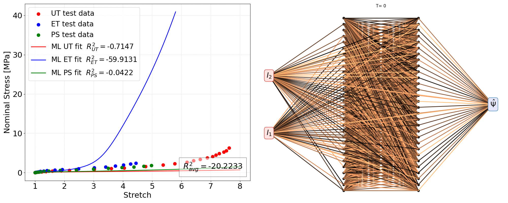

# Extreme sparsification of physics-augmented neural networks for interpretable model discovery in mechanics

  - Author: Jan N Fuhg
  - Organization: UT Austin

Data-driven constitutive modeling with neural networks has received increased interest in recent years due to its ability to easily incorporate physical and mechanistic constraints and to overcome the challenging and time-consuming task of formulating phenomenological constitutive laws that can accurately capture the observed material response. However, even though neural network-based constitutive laws have been shown to generalize proficiently, the generated representations are not easily interpretable due to their high number of trainable parameters. Sparse regression approaches exist that allow for obtaining interpretable expressions, but the user is tasked with creating a library of model forms which by construction limits their expressiveness to the functional forms provided in the libraries. In this work, we propose to train regularized physics-augmented neural network-based constitutive models utilizing a smoothed version of -regularization. This aims to maintain the trustworthiness inherited by the physical constraints, but also enables interpretability which has not been possible thus far on any type of machine learning-based constitutive model where model forms were not assumed a priori but were actually discovered. During the training process, the network simultaneously fits the training data and penalizes the number of active parameters, while also ensuring constitutive constraints such as thermodynamic consistency. We show that the method can reliably obtain interpretable and trustworthy constitutive models for compressible and incompressible hyperelasticity, yield functions, and hardening models for elastoplasticity, using synthetic and experimental data. This work aims to set a new paradigm for interpretable machine learning models in the broad area of solid mechanics where low and limited data is available along with prior knowledge of physical constraints that the learned maps need to obey. This paradigm can potentially be extended to a broader spectrum of scientific exploration.

<p align="center">

</p>

## Installation
This code requires an [Anaconda](https://www.anaconda.com/products/individual) or [Miniconda](https://docs.conda.io/en/latest/miniconda.html) environment with a recent Python version.
The complete repository can be cloned and installed locally. It is recommended to create a conda environment before installation. This can be done by the following the command line instructions

```
$ git clone https://github.com/FuhgJan/ExtremeSparsificationConstitutiveLaws.git
$ conda env create -f environment.yml
$ conda activate extremeSparsification 
$ python -m pip install . --user
```


## Dependencies

Among others, the code requires the following packages as imports:

 - [NumPy](http://numpy.scipy.org) for array handling
 - [Scipy](https://www.scipy.org/) for numerical solutions
 - [torch](https://pytorch.org/) for the neural network and automatic differentiation libraries
 - [MatPlotLib](https://matplotlib.org/) for graphical output


## References
If you use part of this code consider citing:

[1] Fuhg, J. N., et al. "Extreme sparsification of physics-augmented neural networks for interpretable model discovery in mechanics." Computer Methods in Applied Mechanics and Engineering 426 (2024): 116973.

## License

This package comes with ABSOLUTELY NO WARRANTY. This is free
software, and you are welcome to redistribute it under the conditions of
the GNU General Public License
([GPLv3](http://www.fsf.org/licensing/licenses/gpl.html))
